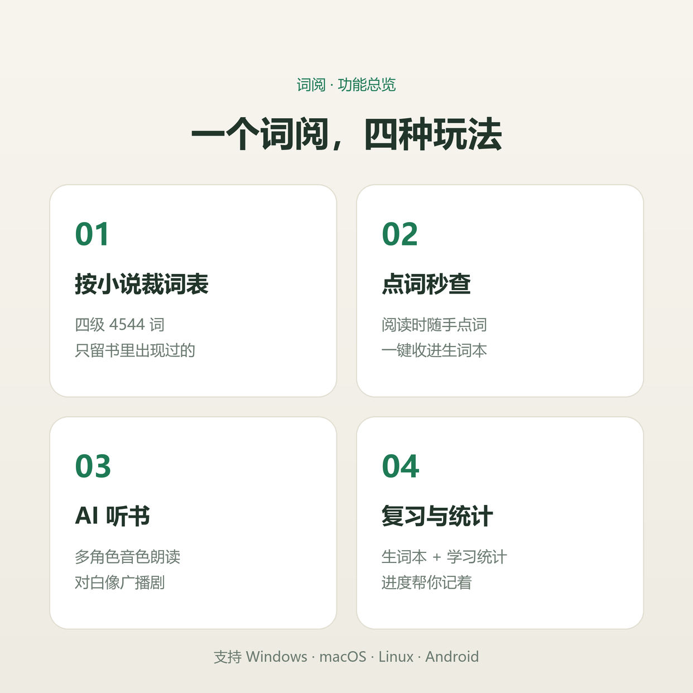

# 词阅 · CiYue

**沉浸读小说，顺手把生词背了**

*本地小说阅读与词汇管理工具 · 免费 · 无广告 · 数据留在本机*

---

## 这是什么

词阅是一款面向外语学习者的桌面应用，把「读小说」和「背单词」合二为一。

传统的背词软件让你对着干巴巴的词表死记硬背，而词阅相信——**生词不是抄下来的，是读出来的**。你在阅读原版小说的过程中，遇到的每一个生词都能即时查看释义、一键收进生词本，再通过间隔重复和多种题型反复巩固，最终把阅读中遇到的词真正变成你自己的词汇。

从导入小说、挑选词表，到边读边点词、AI 听书，再到复习巩固、导出精读 PDF——整个学习闭环都在这一个应用里完成。

> 适用人群：四六级 / 考研 / 雅思托福备考者、英文小说爱好者、想通过阅读提升词汇量的学习者。

---

## ✨ 功能全景

词阅的功能围绕 **读 · 学 · 练 · 出** 四个环节展开：

### 📖 读 — 读得进去，读得舒服

| 功能 | 说明 |
|------|------|
| **多格式小说库** | 支持 TXT / Markdown / EPUB / FB2 导入，拖拽即用；内置搜索、分类与收藏 |
| **沉浸阅读模式** | 字体、字号、行距、段落宽度自由调节；5 档自动滚动速度；章节导航与剩余阅读时间预估 |
| **三档词汇高亮** | 「生疏 / 熟悉 / 已掌握」用不同颜色在正文中直接标注，一眼看出哪些词还没拿下 |
| **阅读进度记忆** | 自动记录每本小说的阅读位置与进度百分比，下次打开无缝续读 |

### 🔍 学 — 点词即查，不打断阅读

| 功能 | 说明 |
|------|------|
| **点词秒查** | 阅读时随手点击生词，即时显示音标与释义，一键收入生词本，不打断阅读节奏 |
| **上下文释义** | 释义优先展示与当前章节语境相关的义项，而非堆砌词典所有含义 |
| **预设词表 + 小说精选** | 内置四级、六级、考研、雅思、中高考、教材分册等词表；可整套导入，也可按当前小说裁剪出专属词表 |
| **AI 多角色听书** | 旁白与对白自动分配不同音色，AI 识别书中角色；7 家朗读音源可选，支持自动连播下一章 |
| **AI 词表增强** | 可选接入 OpenAI 兼容接口，对小说裁剪出的词表做语境复核与释义优化 |

### 🧠 练 — 换着花样练，不枯燥

| 功能 | 说明 |
|------|------|
| **六种复习题型** | 记忆回想、中英互译、拼写测试、听音辨词、例句挖空、上下文猜词，轮换出题 |
| **间隔重复排期（SRS）** | 每次作答后自动安排下次复习时间，首页展示每日目标与待复习数量 |
| **熟练度三档** | 生疏、熟悉、已掌握三级标签，颜色区分，进度可视化 |
| **学习统计** | 生词总数、熟练度分布、最近 7 天复习量，学得怎么样一目了然 |

### 📤 出 — 带走、备份、打印

| 功能 | 说明 |
|------|------|
| **精读 PDF 导出** | 精读版（三步记忆法）与单词卡片版两种模板；带封面、页码与底纹；导出结果附带词汇覆盖率统计 |
| **数据本地存储** | 小说、词汇、进度全部存入本机数据库，不上传任何服务器 |
| **备份与恢复** | 支持手动备份；可设置每天 / 每周 / 每月自动备份 |

---

## 📦 下载

**[⬇️ 前往 Releases 下载最新版本](https://github.com/SiwuXue/CiYue/releases/latest)**

| 平台 | 安装包 |
|------|--------|
| Windows x64 | `novel-words_x.y.z_x64-setup.exe` |
| macOS Intel | `novel-words_x.y.z_x64.dmg` |
| macOS Apple Silicon | `novel-words_x.y.z_aarch64.dmg` |
| Linux x64 | `novel-words_x.y.z_amd64.deb` / `.AppImage` / `.rpm` |
| Android arm64 | `novel-words_x.y.z_universal.apk` |

历史版本请访问 [全部 Releases](https://github.com/SiwuXue/CiYue/releases)。

---

## 💾 数据与隐私

- **完全本地**：所有小说、词汇、阅读进度、复习记录均存储在本机，不上传任何服务器
- **词典资源**：内置英汉词典，点词查义无需联网
- **AI 功能可选**：AI 听书与词表增强需自行配置 API Key，不配置不影响核心功能
- **激活机制**：应用需要免费卡密激活（设备绑定），激活后可离线使用

---

## ❓ 常见问题

<b>如何获取激活卡密？</b>

首次启动应用后按界面指引获取免费卡密，输入即可完成激活。激活绑定设备，一台设备一个卡密。

<b>支持哪些小说格式？</b>

TXT / Markdown / EPUB / FB2。中文小说、英文原著都支持，长篇也不卡。

<b>换电脑怎么办？</b>

使用应用内备份功能导出数据文件，在新电脑恢复即可。

<b>数据会丢失吗？</b>

所有数据存储在本地，建议开启自动备份（每天 / 每周 / 每月可选）。

---

## 反馈

使用中遇到问题或有功能建议，欢迎[提交 Issue](https://github.com/SiwuXue/CiYue/issues)。

---

*如果词阅对你有帮助，欢迎给个 Star ⭐*

