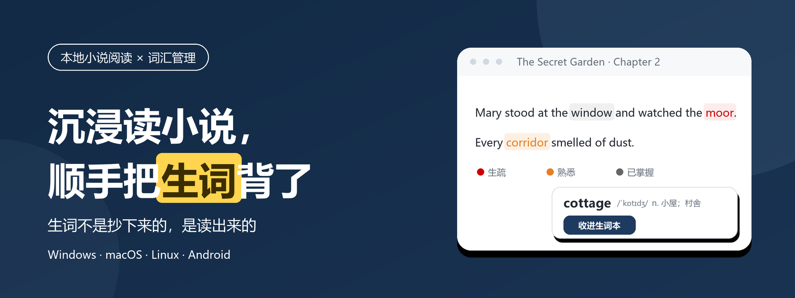
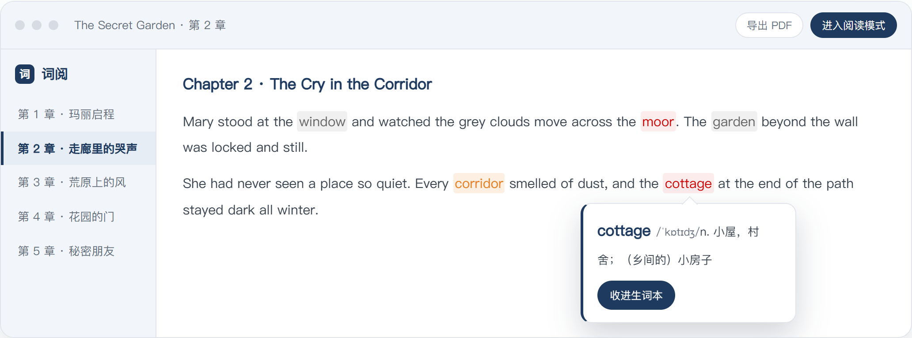
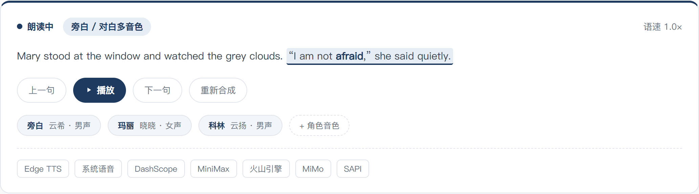
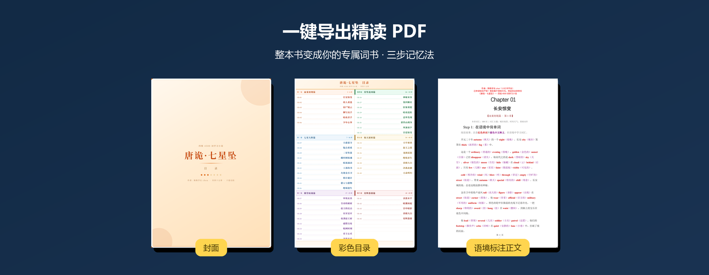

<div align="center">



# 词阅 · CiYue

**把你在读的小说，变成你的单词书**

[](https://github.com/SiwuXue/CiYue/releases/latest)

[](https://ciyue.pages.dev)
[](https://m.tb.cn/h.8vVRTwB?tk=zATHTmMcXx6)

</div>

---

## 为什么不用传统背单词 App？

| | 传统背单词 App | 词阅 |
|---|---|---|
| 记忆方式 | 对着干巴巴的词表死记 | 生词出现在你**正在读的故事**里 |
| 释义 | 一词几十个义项全堆给你 | 优先显示**当前章节语境**的含义 |
| 巩固 | 背了就忘 | 读完顺手收进生词本，间隔重复自动排期 |
| 产出 | 打卡天数 | 一本读完的书 + 真正属于你的词汇量 |

> **生词不是抄下来的，是读出来的。**

## 应用长这样

**阅读时，生疏 / 熟悉 / 已掌握三档颜色直接标在正文里，点词即出释义，一键收进生词本——不打断阅读节奏：**



**不想看屏幕？AI 自动识别书中角色，旁白和对白用不同音色朗读，7 家音源可选：**



**随时把整本书导出为精读 PDF——封面、彩色目录、语境标注正文，打印出来也能背：**



## 四步开始

```
导入小说 ──► 挑一本词书 ──► 边读边点词 ──► 复习与导出
TXT/EPUB     四六级/考研/     三档高亮 +      六种题型 +
MD/FB2       雅思/中高考      AI 听书         间隔重复
```

## 功能速查

| 环节 | 功能 |
|------|------|
| **读** | TXT / Markdown / EPUB / FB2 导入 · 沉浸阅读模式（字体行距可调、自动滚动、进度记忆）· 三档词汇高亮 |
| **学** | 点词秒查 · 上下文释义 · 内置四级 / 六级 / 考研 / 雅思 / 中高考词表 · 按小说裁剪专属词表 · AI 多角色听书 · AI 词表增强 |
| **练** | 六种复习题型（回想 / 互译 / 拼写 / 听辨 / 挖空 / 猜词）· 间隔重复排期 · 熟练度三档 · 学习统计 |
| **出** | 精读 PDF / 单词卡片导出（带覆盖率统计）· 数据本地存储 · 自动备份 |

## 📦 下载

**[⬇️ 前往 Releases 下载最新版本](https://github.com/SiwuXue/CiYue/releases/latest)**

| 平台 | 安装包 |
|------|--------|
| Windows x64 | `*_x64-setup.exe` |
| macOS Intel / Apple Silicon | `*_x64.dmg` / `*_aarch64.dmg` |
| Linux x64 | `*_amd64.deb` / `.AppImage` / `.rpm` |
| Android arm64 | `*_universal.apk` |

> **🔑 激活说明**：应用免费下载，首次启动输入**激活码**即可解锁全部功能（一码一设备）。
> 激活码在闲鱼发售，下单后即发：**[前往闲鱼购买激活码](https://m.tb.cn/h.8vVRTwB?tk=zATHTmMcXx6)**

## 💾 数据与隐私

- **完全本地**：小说、词汇、进度全部存储在本机，不上传任何服务器
- **内置词典**：点词查义无需联网
- **AI 可选**：听书与词表增强需自行配置 API Key，不配置不影响核心功能

## ❓ 常见问题

<details>
<summary><b>如何获取激活码？</b></summary>
在 <a href="https://m.tb.cn/h.8vVRTwB?tk=zATHTmMcXx6" target="_blank" rel="noopener">闲鱼</a> 下单购买，下单后即发。首次启动应用时输入激活码即可完成激活，激活绑定设备，一台设备一个激活码。
</details>

<details>
<summary><b>支持哪些小说格式？</b></summary>
TXT / Markdown / EPUB / FB2。中文小说、英文原著都支持，长篇也不卡。
</details>

<details>
<summary><b>换电脑怎么办？</b></summary>
使用应用内备份功能导出数据文件，在新电脑恢复即可。
</details>

<details>
<summary><b>数据会丢失吗？</b></summary>
所有数据存储在本地，建议开启自动备份（每天 / 每周 / 每月可选）。
</details>

---

## 反馈

使用中遇到问题或有功能建议，欢迎[提交 Issue](https://github.com/SiwuXue/CiYue/issues)。

---

<div align="center">

*如果词阅对你有帮助，欢迎给个 Star ⭐*

</div>
